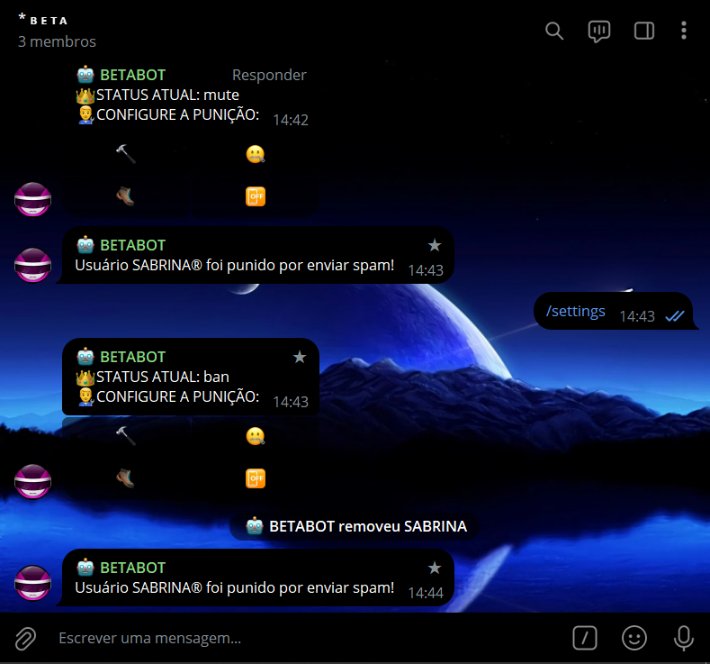
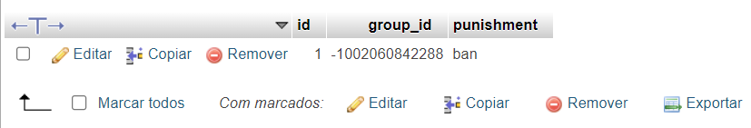

# MODERADOR ANTISPAM SQL
🤤ESSE É UM BOT DO TELEGRAM QUE PENALISA OS MEMBROS QUE ENVIAREM SPAM (COM PERSONALIZAÇÃO VIA MYSQL)!

 <br>
 <br>

## DESCRIÇÃO:
Este bot implementa uma funcionalidade de configuração de punições para um grupo de Telegram. Ele permite que administradores do grupo configurem diferentes tipos de punições para usuários que enviam spam, como banimento, silenciamento, expulsão do grupo, ou desativar a punição.

O bot possui os seguintes recursos:

Este bot foi projetado para gerenciar configurações de punição em grupos do Telegram. Aqui está uma explicação simplificada do funcionamento:

1. Quando um administrador do grupo digita o comando `/settings`, o bot verifica se o remetente é um administrador do grupo. Se for, ele busca a punição atualmente configurada para o grupo no banco de dados e exibe um painel de botões com opções de punição: banir, silenciar, expulsar ou desligar a função anti-spam.

2. Quando um administrador do grupo seleciona uma opção de punição no painel de botões, essa escolha é salva no banco de dados associado ao ID do grupo. Em seguida, a punição é aplicada ao membro alvo, se apropriado.

3. O bot também monitora mensagens de texto no grupo. Se detectar a presença de links em mensagens de não-administradores, o bot remove a mensagem e aplica a punição configurada para o grupo.

4. As configurações de punição são personalizáveis para cada grupo, permitindo que diferentes grupos tenham diferentes níveis de tolerância ao spam.

5. As interações com o banco de dados MySQL são tratadas através de funções como `save_punishment` e `get_punishment`, que salvam e recuperam informações sobre as punições configuradas para cada grupo.

## COMO USAR?
### BAIXANDO O PROJETO:
**Passo 1:** Clone o repositório para o seu sistema local.

```bash
git clone https://github.com/VILHALVA/MODERADOR-ANTISPAM-SQL.git
```

**Passo 2:** Navegue até o diretório do projeto.

```bash
cd MODERADOR-ANTISPAM-SQL
```

**Passo 3:** Descompacte o arquivo ZIP (se você baixou manualmente):

```bash
unzip MODERADOR-ANTISPAM-SQL.zip
```

### EXECUTANDO O PROJETO:
1. **Configuração do Banco de Dados:**

   - Você deve importar o arquivo `DATABASE.sql` para o seu BANCO DE DADOS.

   - Se você não estiver familiarizado com esses passos, confira nosso [curso completo de MYSQL](https://github.com/VILHALVA/CURSO-DE-MYSQL) para obter orientações detalhadas.

2. **Editar o código:**
   - Certifique-se de substituir "localhost", "seu_usuario" e "sua_senha" no arquivo `DB_CONNECTION.py` pelas informações corretas do seu banco de dados MySQL.

3. **Coloque o Token:**
   - Antes de executar o programa, é necessário substituir o token do seu bot no arquivo `TOKEN.py`, o qual pode ser obtido por meio do [@BotFather](https://t.me/BotFather). Certifique-se também de que todas as dependências estejam instaladas em sua máquina. Se você não estiver familiarizado com esses passos, confira nosso [curso completo sobre a criação de bots no Telegram](https://github.com/VILHALVA/CURSO-DE-TELEGRAM-BOT) para obter orientações detalhadas.

4. **Inicie o Bot:**
   - Execute o bot do Telegram em Python iniciando-o com o seguinte comando:
```bash
   python MAIN.py
```
   - Inicie o bot enviando o comando `/settings`. E configure a punição para o seu grupo clicando no botão inline.

## CREDITOS:
- [PROJETO CRIADO PELO VILHALVA](https://github.com/VILHALVA)

